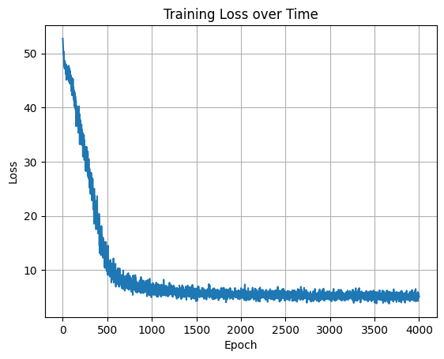

# Vanilla RNN from Scratch 🧠

This project implements a character-level Recurrent Neural Network (RNN) **entirely from scratch using only NumPy**. It's a deep dive into the foundational mechanics of RNNs, demonstrating how these networks operate at their core without relying on high-level deep learning libraries like TensorFlow or PyTorch.

---

## Why "From Scratch"? (New Section)

Implementing an RNN from the ground up offers unparalleled insights into:

* **Core Mechanics**: Understanding the low-level computations involved in forward propagation, backpropagation through time (BPTT), and gradient calculations.
* **Architectural Nuances**: Grasping how RNN cells process sequential data and maintain hidden states.
* **Debugging & Optimization**: Developing a deeper intuition for common issues like vanishing/exploding gradients and how techniques like gradient clipping address them.
* **Educational Value**: A robust learning experience for anyone looking to truly master the inner workings of recurrent neural networks.

---

## Features

-   Character-level language modeling
-   **Manual, low-level implementation of:**
    * RNN cell forward pass
    * RNN cell backward pass
    * Full RNN forward and backward over sequences
    * Softmax-based prediction
    * Cross-entropy loss
-   Support for mini-batch training
-   Character sampling/generation with temperature control
-   Clean and readable code, fully commented

---

## Loss Curve

Below is the training loss plotted over epochs:



---

## Example Output

Here are some sample text generations from the trained model:

Sample starting with 'm':  

```
manually. it is hard but also rewarding. this model learns to predict next characters. eventually it will generate realistic text samples. scearns to predict next character-level rnn trained from scrat
```

Sample starting with 't':  

```
trained from scratch. you are building backprop through time manually. it is hard but also rewarding. this model learns to predict next character-level rnn trained from scratch. you are building backpr
```

Sample starting with 'r':  
```
rewarding. this model learns to predict next characters. eventually it will generate realistic text samples. shqodict next. this is a custom characters. eventually it will generate realistic text. this
```
---

## TODOs / Extensions
-   Add LSTM and GRU variants
-   Add support for word-level tokenization
-   Add gradient clipping (Crucial for RNNs!)
-   Integrate CLI for text input and live sampling
-   Export trained weights and reload later

---

## 👨‍💻 Author

**Nabeel Shan**  
Software Engineering Student - NUST Islamabad, Pakistan  
Aspiring AI/ML Engineer | AI/ML Enthusiast

* [LinkedIn](https://www.linkedin.com/in/nabeelshan)
* [GitHub](https://github.com/nabeelshan78)

-   Currently focused on mastering RNNs, LSTM, GRUs, and other Deep Learning architectures through hands-on work.
-   Actively seeking collaboration on AI/ML projects or research opportunities, and aiming for fully-funded Master's programs in AI/ML.

---

## ⭐ Star the Repo

If you found this helpful, please consider **starring** 🌟 the repository - it helps others discover this resource and motivates continued open-source contributions.

---
